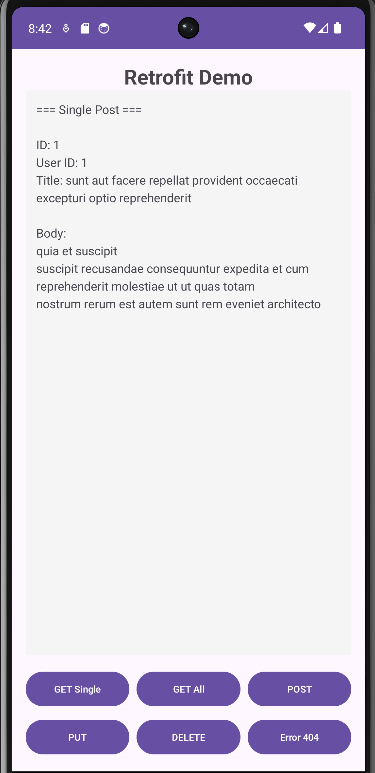
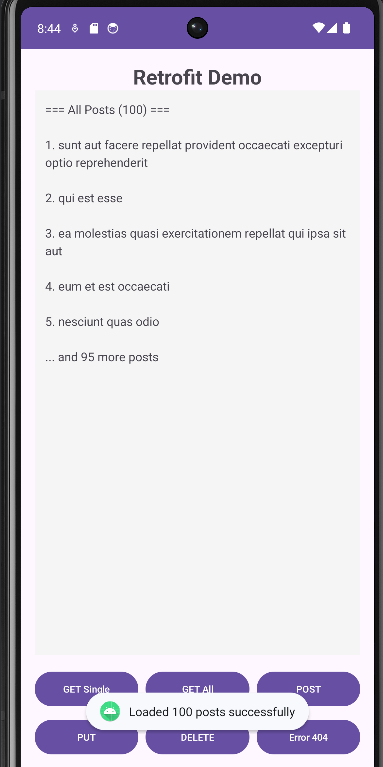
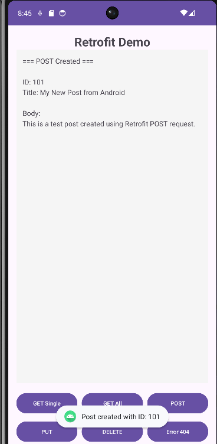
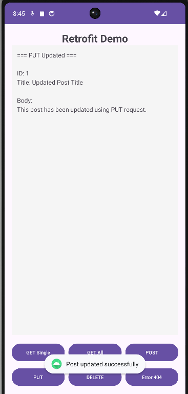
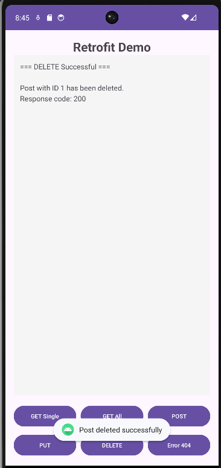
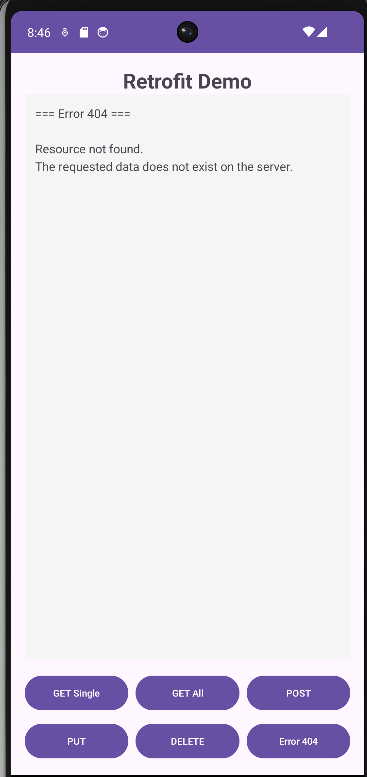
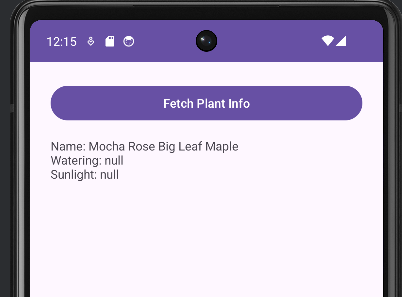

# Android Retrofit

Ta projekt prikazuje osnovno uporabo knjižnice Retrofit v Android aplikaciji. Retrofit je ena izmed najbolj priljubljenih knjižnic za izvajanje HTTP zahtevkov in delo z API-ji. Uporablja se predvsem v Android projektih, zato spada med platformno odvisne tehnologije.

## Zakaj sem izbral Retrofit?

Retrofit sem izbral zato, ker močno poenostavi komunikacijo s splet­nimi API-ji. Večina sodobnih mobilnih aplikacij potrebuje pridobivanje podatkov iz interneta, zato je takšna knjižnica zelo uporabna in praktična. Delo je veliko bolj pregledno kot pri ročni uporabi `HttpUrlConnection`, hkrati pa lepo sodeluje s Kotlin coroutines.

## Prednosti

- enostavna definicija API klicev z anotacijami (`@GET`, `@POST`, …)
- samodejna pretvorba JSON podatkov v Kotlin razrede
- dobra integracija s coroutines (asinhrono izvajanje)
- enostavnejše obravnavanje napak
- zelo razširjena in dobro dokumentirana knjižnica

## Slabosti

- vezana je na Android/JVM okolje, zato ni uporabna na drugih platformah
- zahteva dodatne knjižnice (npr. Gson ali Moshi za pretvorbo JSON)
- ni primerna za realnočasovno komunikacijo (WebSocketi ipd.)

## Licenca

Retrofit spada pod Android Open Source Project ki uporablja **Apache License 2.0**, kar pomeni, da je dovoljena uporaba tako v odprtokodnih kot tudi komercialnih projektih.
- [Link do licenca](https://source.android.com/license)

## Priljubljenost in uporaba
Podatki za leto 2025:

Retrofit je ena najbolj znanih knjižnic v Android svetu.  
Na GitHubu ima več kot 42.000 GitHub zvezdic, okrog 7.000 forkov, uporablja ga več milijonov Android aplikacij. Zaradi velike skupnosti je dobro podprt in redno posodobljen.

## Časovna in prostorska zahtevnost

- čas izvajanja je odvisen od omrežja in velikosti JSON podatkov (približno O(n))
- pomnilniška poraba je majhna, knjižnica pa ne poveča aplikacije za veliko (okoli nekaj sto KB)

## Razvoj in vzdrževanje

Retrofit razvija podjetje Square. Knjižnica je aktivno vzdrževana, redno posodabljana in ima 20+ aktivnih razvijalcev, posodobitve so redne. Zaradi velike uporabe v industriji je razvoj stabilen in dolgoročno zagotovljen.

## Uporaba

### Odvisnosti

```kotlin
dependencies {
    implementation("com.squareup.retrofit2:retrofit:2.9.0")
    implementation("com.squareup.retrofit2:converter-gson:2.9.0")
    implementation("com.squareup.okhttp3:logging-interceptor:4.11.0")
    implementation("org.jetbrains.kotlinx:kotlinx-coroutines-android:1.7.1")
    implementation("androidx.lifecycle:lifecycle-runtime-ktx:2.6.2")
}
```

```xml
<uses-permission android:name="android.permission.INTERNET" />
```

### HTTP Metode, ki jih podpira Retrofit

| **HTTP Metoda** | **Opis** |
|-----------------|----------|
| `@GET` | Pridobivanje podatkov |
| `@POST` | Ustvarjanje novih podatkov |
| `@PUT` | Posodabljanje obstoječih podatkov |
| `@DELETE` | Brisanje podatkov |
| `@PATCH` | Delna posodobitev podatkov |
| `@HEAD` | Pridobivanje samo headerjev |
| `@OPTIONS` | Pridobivanje podprtih metod |

###  Definicija data class za JSON mapping

```kotlin
data class Post(
    val userId: Int,
    val id: Int,
    val title: String,
    val body: String
)
```

###  Kreiranje API interface z anotacijami

```kotlin
interface ApiService {

    @GET("posts/{id}")
    suspend fun getPostById(@Path("id") id: Int): Response<Post>

    @GET("posts")
    suspend fun getAllPosts(): Response<List<Post>>

    @GET("posts")
    suspend fun getPostsByUser(@Query("userId") userId: Int): Response<List<Post>>

    @POST("posts")
    suspend fun createPost(@Body post: Post): Response<Post>

    @PUT("posts/{id}")
    suspend fun updatePost(
        @Path("id") id: Int,
        @Body post: Post
    ): Response<Post>

    @DELETE("posts/{id}")
    suspend fun deletePost(@Path("id") id: Int): Response<Unit>
}
```

### Demonstracije funkcionalnosti

## 1. Get (Single Post)

```kotlin
private fun loadSinglePost() {
    lifecycleScope.launch {
        val response = RetrofitInstance.api.getPostById(1)
        handleResponse(response) { post ->
            txtResult.text = "ID: ${post.id}\nTitle: ${post.title}"
        }
    }
}
```



## 2. Get (All Posts)

```kotlin
private fun loadAllPosts() {
    lifecycleScope.launch {
        val response = RetrofitInstance.api.getAllPosts()
        handleResponse(response) { posts ->
            txtResult.text = "=== All Posts (${posts.size}) ==="
            posts.take(5).forEach { post ->
                append("${post.id}. ${post.title}\n")
            }
        }
    }
}
```



## 3. Post (New Post)

```kotlin
private fun createPost() {
    lifecycleScope.launch {
        val newPost = Post(
            userId = 1,
            title = "My New Post from Android",
            body = "Test post created using Retrofit"
        )
        val response = RetrofitInstance.api.createPost(newPost)
        handleResponse(response) { createdPost ->
            showToast("Post created with ID: ${createdPost.id}")
        }
    }
}
```



## 4. Put (Update Post)

```kotlin
private fun updatePost() {
    lifecycleScope.launch {
        val updatedPost = Post(
            userId = 1,
            id = 1,
            title = "Updated Post Title",
            body = "This post has been updated"
        )
        val response = RetrofitInstance.api.updatePost(1, updatedPost)
        handleResponse(response) { post ->
            showToast("Post updated successfully")
        }
    }
}
```



## 5. Delete (Delete Post)

### Uporaba v lastnem projektu (PlantPal)

```kotlin
private fun deletePost() {
    lifecycleScope.launch {
        val response = RetrofitInstance.api.deletePost(1)
        if (response.isSuccessful) {
            txtResult.text = "Post with ID 1 has been deleted"
        }
    }
}
```



## 6. Error (Error Test)

```kotlin
private fun handleNetworkError(e: IOException) {
    txtResult.text = """
        === Network Error ===
        Unable to connect to server.
        Possible causes:
        • No internet connection
        • Server is down
        • Request timeout
    """.trimIndent()
}
```



### Uporaba v lastnem projektu (PlantPal)

Knjižnica Retrofit je uporabljena v lastnem Android projektu PlantPal, kjer služi za pridobivanje podatkov o rastlinah iz zunanjega REST API-ja (Perenual Plant API).

V aplikaciji je implementiran poseben zaslon PlantInfoActivity, ki ob uporabniški interakciji izvede asinhroni HTTP zahtevek prek knjižnice Retrofit. Pridobljeni podatki (ime rastline, način zalivanja, zahteve glede svetlobe) se razčlenijo iz JSON odgovora in prikažejo v uporabniškem vmesniku.

Retrofit je integriran skupaj s Kotlin korutinami. Implementirano je tudi osnovno rokovanje z napakami, kot so neuspešni HTTP odgovori ali omrežne izjeme, ki se uporabniku prikažejo v obliki sporočila.

Uporaba zunanjega API-ja omogoča aplikaciji, da namesto statičnih podatkov uporablja dinamične in posodobljive informacije o rastlinah, kar predstavlja realen primer uporabe Retrofit knjižnice v platformno odvisnem Android okolju.

## Primer slika:

Brezplačni API ne ponuja vseh podatkov :(

